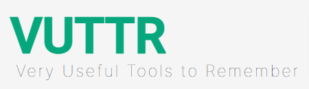
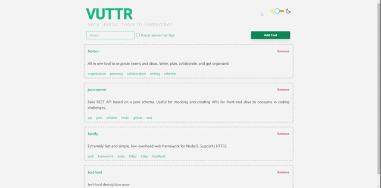

<p align="center">
  
</p>

<p align="center">
  <a href="#-technologies">Technologies</a>&nbsp;&nbsp;&nbsp;|&nbsp;&nbsp;&nbsp;
  <a href="#-getting-started">Getting started</a>&nbsp;&nbsp;&nbsp;|&nbsp;&nbsp;&nbsp;
  <a href="#-project">Project</a>&nbsp;&nbsp;&nbsp;|&nbsp;&nbsp;&nbsp;
  <a href="#-layout">Layout</a>&nbsp;&nbsp;&nbsp;|&nbsp;&nbsp;&nbsp;
  <a href="#-next-steps">Next steps</a>
</p>

<h1 align="center">
  <a href="https://vuttr-eltonsantos.netlify.app" target="_blank">
    
  </a>
</h1>

---

## 🧪 Technologies

This project was developed using the following technologies:

- [React](https://reactjs.org)
- [React Switch](https://www.npmjs.com/package/react-switch)
- [Polished](https://polished.js.org/)
- [Axios](https://www.npmjs.com/package/axios)
- [React Loading Skeleton](https://www.npmjs.com/package/react-loading-skeleton)
- [Tailwind](https://tailwindcss.com/)
- [Styled Icons](https://styled-icons.js.org/)
- [Styled Components](https://styled-components.com/)

## 🚀 Getting started

Clone the project and access the folder

```bash
$ git clone https://github.com/eltonsantos/vuttr.git && cd vuttr
```

Follow the steps below
```bash
# Install the dependencies
$ yarn

# Start the project
$ yarn start

# Open another bash tab and start server
$ npx json-server db.json
```
The api will be running on port 3000 and the app in another port.

## 💻 Project

This project was developed within the challenge proposed by [BossaBox](https://bossabox.com/). **VUTTR (Very Useful Tools To Remember)** is a simple application to manage tools with their respective names, links, descriptions and tags.

In order for this project to be approved, the following minimum requirements must be met:

- The user can see all available tools.

- The user can add a new tool.

- The user can remove a tool.

- The user can search for a tool filtering (or not) by tags.

## 🔖 Layout

The layout was created from scratch using the **TailWindCSS** framework.

## 🐾 Next steps

###### Escreverei essa parte em português

- [ ] Implementar layout infinito para mostrar todas as ferramentas na mesma tela ♾
- [ ] Adicionar um botão no canto para voltar rapidamente ao topo 🔼
- [ ] Ajustar alguns detalhes para o Layout ficar bem resposivo e fofo 🥰
- [ ] Validar os campos para evitar fazerem besteira 🐱‍💻
- [ ] Login e senha para acessar a api também pode ser uma opção 🔐
- [ ] E muito mais... ❤💪🏼

---

## 👨🏻‍💻 Author

<h3 align="center">
  
  <br/>
  <strong>Elton Santos</strong> 🚀
  <br/>
  <br/>

 <a href="https://www.linkedin.com/in/eltonmelosantos" alt="LinkedIn" target="blank">
    
  </a>

  <a href="mailto:elton.melo.santos@gmail.com?subject=Olá%20Elton" alt="Email" target="blank">
    
  </a>

<br/>

Made with ❤️ by Elton Santos 👋🏽 [Entre em contato!](https://www.linkedin.com/in/eltonmelosantos/)

</h3>